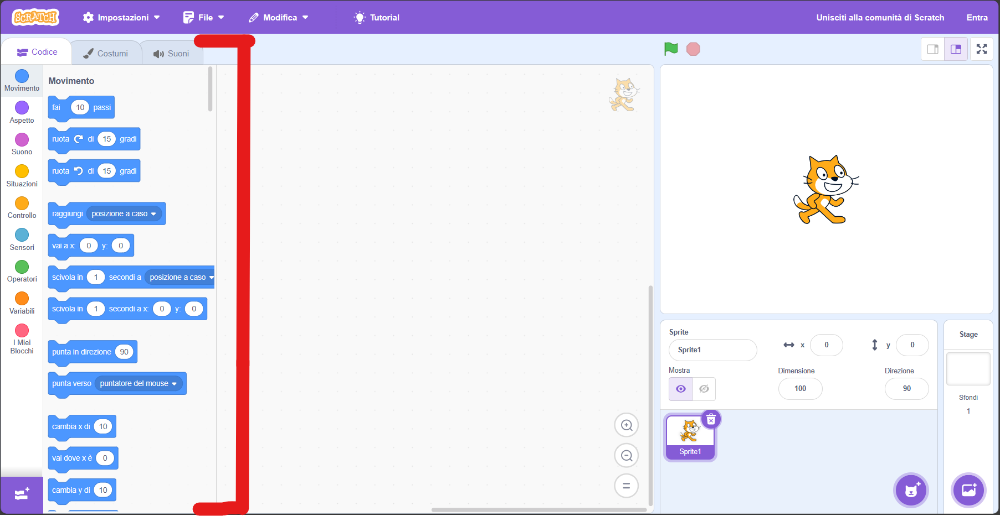
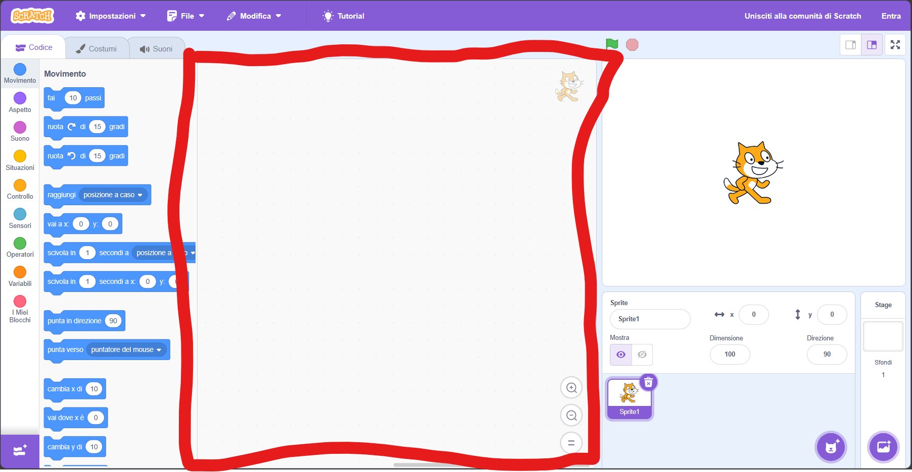
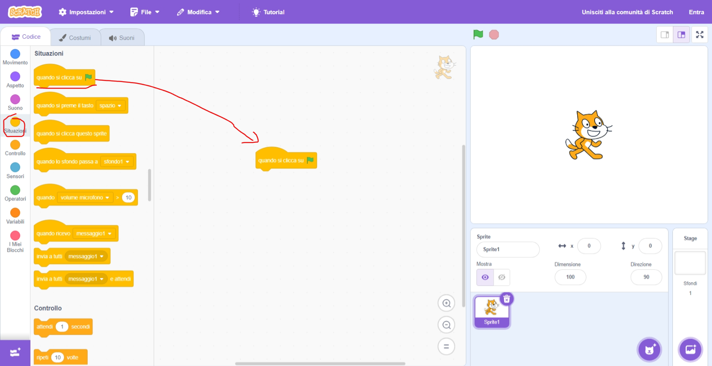
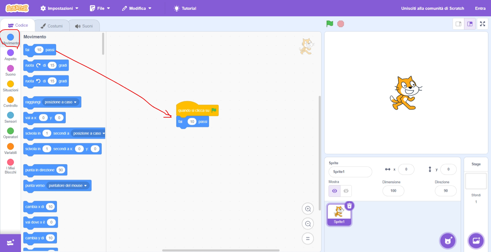
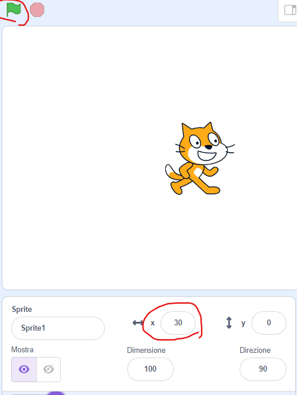
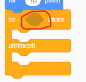
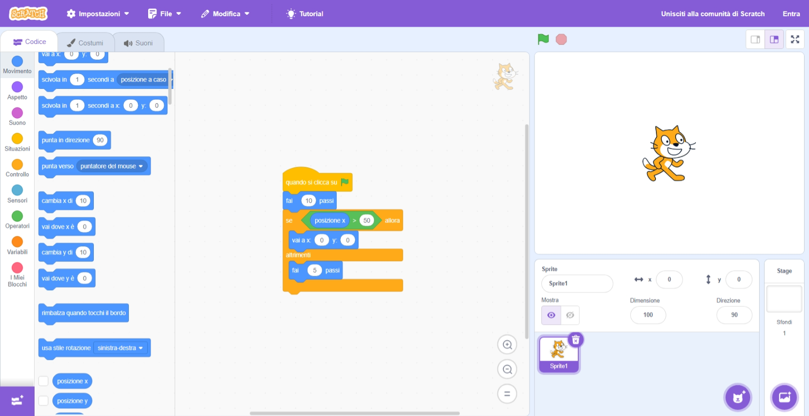
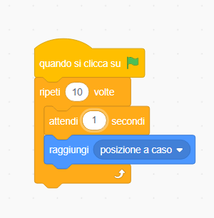

[indietro](/PrimoAnno/index.md)

---

# Scratch
Fornisce le basi per iniziare a capire la programmazione: [scratch](https://scratch.mit.edu/projects/editor/) (basta cercare "scratch" su internet).
Permette di far muovere, parlare (e altre azioni) uno sprite (il gatto arancione) tramite un codice costruibile trascinando le varie istruzioni dal pannello di destra a quello centrale.

### Istruzioni utilizzabili
Si trovano sulla parte destra della pagina e ne esistono di diverse tipologie:
  1. **Movimento**: vengono usate per far muovrere lo sprite
  2. **Aspetto**: permettono di far "parlare" o cambiare aspetto allo sprite o alla scena (lo sfondo dietro il gatto/sprite)
  3. **Suono**: permettono di riprodurre dei suoni
  4. **Situazioni**: servono per attendere una certa situazione prima di proseguire
  5.  **Controllo**: sono i blocchi che esistono effettivamente anche nella programmazione e permettono di creare una logica
  6.  **Sensori**: sono utilizzati per aspettare certe condizioni (mouse che tocca lo sprite, tasto che viene premuto)
  7.  **Operazioni**: permette di fare delle operazioni con i numeri, i testi (chiamati stringhe in programmazione) e operazioni logiche (Vero e Falso)
  8.  **Variabili**: definiscono una zona in memoria che può essere gestita da noi per memorizzare dei dati

###  Come programmare
Si prendono le istruzioni dalla parte sinistra della pagina e si trascinano al centro:

Partiamo con il blocco preso da "Situazioni" : 

questo blocco aspetta che si clicchi sulla bandierina verde prima di eseguire i blocchi successivi.

Ora aggiungiamo un blocco da "Movimenti" per spostare il gatto quando si clicca sulla bandiera verde:

Si trascina il blocco e lo si "aggancia" a quello precedentemente posizionato.

Ora se si clicca sulla bandierina verde il gatto si muoverà del numero di passi scritti dentro il blocco azzurro appena posizionato: in questo caso 10.

Come si vede da questa immagine dopo aver premuto 3 volte la bandierina verde la posizione x è arrivata a 30.

### Strutture di controllo
Le strutture di controllo permettono di valutare delle condizioni ed eseguire delle scelte:
#### Strutture decisionali
prendiamo da "Controllo" il blocco "se - altrimenti": 
dove c'è scritto "se" si può vedere un rombo vuoto: in questa posizione possiamo inserire la condizione da verificare.

I "buchi" con una certa forma possono essere riempiti solo con un blocco della stessa forma. Quindi nel rombo può essere posizionata solo un'istruzione a forma di rombo.
 Proseguiamo il programma controllando questa condizione: 
se la posizione dello sprite è maggiore di 50 ritorna alla posizione x=0 e y=0, altrimenti fai altri 5 passi.

#### Strutture cicliche 

Una struttura ciclica ripete il numero indicato di volte (oppure infinite volte) il codice al suo interno.
Ad esempio:

Ripete 10 volte consecutive i passaggi al suo interno, analizzando quindi questo codice:

| passaggio | Spiegazione                                                       | Contatore ciclo            |
| --------- | ----------------------------------------------------------------- | -------------------------- |
| 1         | Premuta la bandierina                                             |                            |
| 2         | Entro nel ciclo                                                   | contatore = 0              |
| 3         | Se il contatore è minore di 10 vai al passaggio 4 altrimenti al 7 |                            |
| 4         | Aspetto 1 secondo                                                 |                            |
| 5         | Sposta a caso il gatto                                            |                            |
| 6         | Incrementa il contatore e torna a 3                               | coontatore = contatore + 1 |
| 7         | Fine del programma                                                | contatore = 0              |

Ad ogni fine ciclo viene incrementato il contatore e si ritorna ad eseguire il codice al suo interno fino a che raggiunge la condizione in cui il contatore supera il numero di volte che gli è stato imposto (in questo caso 10). Quando questo succede il ciclo termina e si esce.

---
[indietro](/PrimoAnno/index.md)