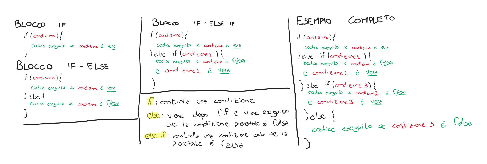

# Struttura IF

Permette di eseguire un blocco di codice solamente se una condizione è rispettata:

## Come si usa

La struttura if serve per controllare una condizione, deve essere scritta come segue:

    if ( condizione ) {
        ...codice da eseguire..
    }

Tutto il codice che c'è dentro le parentesi graffe viene eseguito solo se la condizione è vera.

Di seguito uno schema di come utilizzare if, if-else, else if:
