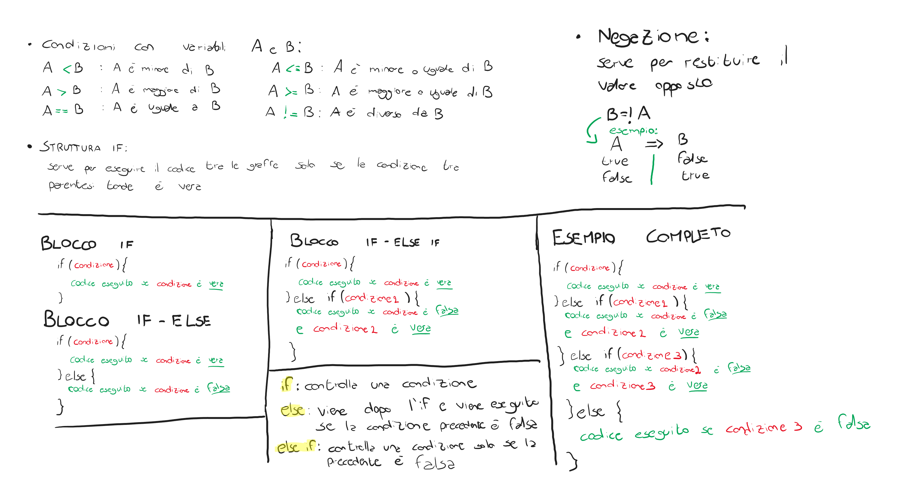

# Struttura IF

Permette di eseguire un blocco di codice solamente se una condizione è rispettata, può essere pensato in questo modo: il computer eseguira il codice solo se la domanda che gli facciamo ha come risposta "vero".

## Come si usa

La struttura if serve per controllare una condizione, deve essere scritta come segue:

    if ( condizione ) {
        ...codice da eseguire...
    }

Tutto il codice che c'è dentro le parentesi graffe viene eseguito solo se la condizione è vera (si possono scrivere quante operazioni si vogliono).

Di seguito uno schema di come utilizzare if, if-else, else if:


## Funzionamento e Regole:
Il blocco if esegue le operazioni in quest'ordine:
1. Controlla la condizione tra le parentesi
2. Se la condizione è *vera* allora esegue tutto il codice che è contenuto tra le sue parentesi graffe, altrimenti, se è *falsa* il programma va subito alla parentesi graffa di chiusura,

### La condizione:
Tra le parentesi tonde bisogna inserire una condizione: una condizione può essere pensata come un controllo e restituisce solo due valori possibili: **VERO** oppure **FALSO**.
Una condizione potrebbe essere ad esempio: 

> La variabile NUMERO è uguale a 7?

Questa affermazione può essere o vera o falsa: o è uguale a 7 oppure è diversa da 7. Allo stesso modo si possono fare diverse operazioni di confronto:
> Facciamo finta che A e B siano due variabili nel nostro codice.

| Domanda                     | Operazione      | Simbolo | Codice |
| --------------------------- | --------------- | ------- | ------ |
| A è uguale a B?             | uguale          | **==**  | A == B |
| A è maggiore di B?          | maggiore        | >       | A > B  |
| A è maggiore o uguale di B? | maggiore uguale | >=      | A >= B |
| A è minore di B?            | minore          | <       | A < B  |
| A è minore o uguale di B?   | minore uguale   | <=      | A <= 7 |
| A è diverso da B            | non uguale      | !=      | A != B |

Un'operazione di controllo restituisce sempre un valore [boolean](./../Variabili/datatypes.md#bool).

### Funzionamento:

Ad esempio se vogliamo controllare se A è maggiore o minore o uguale di B: 

```c
#include <stdio.h>

int main(){
    int A = 5;
    int B = 7;
    
    if(A > B){    //INIZIO BLOCCO DI CODICE 1
        printf("A è maggiore di B");
    }             //FINE BLOCCO DI CODICE 1

    if(A == B){   //INIZIO BLOCCO DI CODICE 2
        printf("A è uguale a B");
    }             //FINE BLOCCO DI CODICE 2

    if(A < B){   //INIZIO BLOCCO DI CODICE 3
        printf("A è minore di B");
    }             //FINE BLOCCO DI CODICE 3

    return 0;
}

```
In questo modo il codice:
1. controlla prima se A > B, se è vero eseguirà tutto il codice che è all'interno delle parentesi graffe del primo IF, altrimenti va direttamente alla parentesi graffa di chiusura del blocco di codice 1;
2. controlla poi se A == B (uguale a), se è vero eseguirà tutto il codice che è all'interno delle parentesi graffe del secondo IF, altrimenti va direttamente alla parentesi graffa di chiusura del blocco di codice 2;
3. controlla infine se A è minore di B, se è vero eseguirà tutto il codice che è all'interno delle parentesi graffe del terzo IF, altrimenti va direttamente alla parentesi graffa di chiusura del blocco di codice 3;


## [Clicca qui per continuare : IF-ELSE](./struttura_if_else.md)