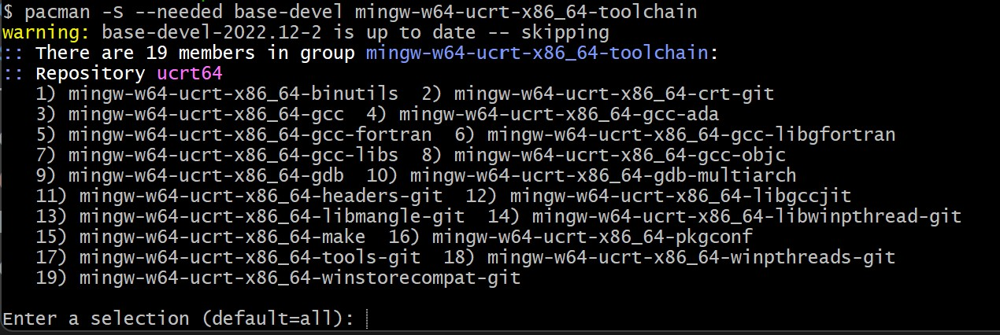

[indietro](./index.md)

---

# Come installare Visual Studio Code

Andare su [questo sito](https://code.visualstudio.com/) e dalla pagina scaricare la versione per il proprio computer premendo sul pulsante che appare.

Una volta scaricato il file eseguirlo per installare il programma.

Una volta che si apre questa schermata permere su "Accetta i termini ..." e proseguire senza cambiare nessun impostazione.

Alla fine della procedura il programma è installato.

# Impostare Visual Studio Code

Quando si apre Visual Studio Code premere sul pulsante laterale delle "Estensioni":

Dopo aver cliccato cercare nella lista che appare queste due indicate con il rosso:

Cliccare su "Installa" per entrambi.

# Installare il compilatore

1) Scaricare [questo programma](https://github.com/msys2/msys2-installer/releases/download/2023-05-26/msys2-x86_64-20230526.exe)
2) Aprire il file appena scaricato e ad ogni pagina <u>**cliccare "successivo"**</u> finchè non si installa
3) Appena si apre il terminale incollare questo comando:
<code>pacman -S --needed base-devel mingw-w64-ucrt-x86_64-toolchain</code>

    Il terminale è questo:

    

    Copiare il comando premendo i tasti contemporaneamente : CTRL + C

    Incollarli nel terminale premendo il tasto destro e schicciando "paste" dopo <u>**premere invio**</u>

    

    

4) Appena il terminale si ferma a questa schermata che si ferma alla riga "Enter a selection (dafault=all): " <u>**premere invio**</u>
    
    

5) Appena il programma si ferma di nuovo ed esce qualcosa con scritto alla fine "[Y/n]" <u>**scrivere Y e premere invio**</u>

6) Cercare nella barra di windows <code>Modifica variabili di ambiente per l'account</code>

    

    Nella finestra che si apre cliccare due vole nella riga con scritto "Path" (nell'immagine è quella selezionata in blu)

    

    Dopo aver cliccato due volte su "Path" si apre la lista che si vede qua sotto (non per forza con le stesse cose).

    

    <u>**Cliccare sul pulsante "Nuovo" e incollare**</u> <code>C:\msys64\ucrt64\bin</code>

    

    Poi chiudere TUTTE LE FINESTRE <u>**premendo "OK"**</u>
